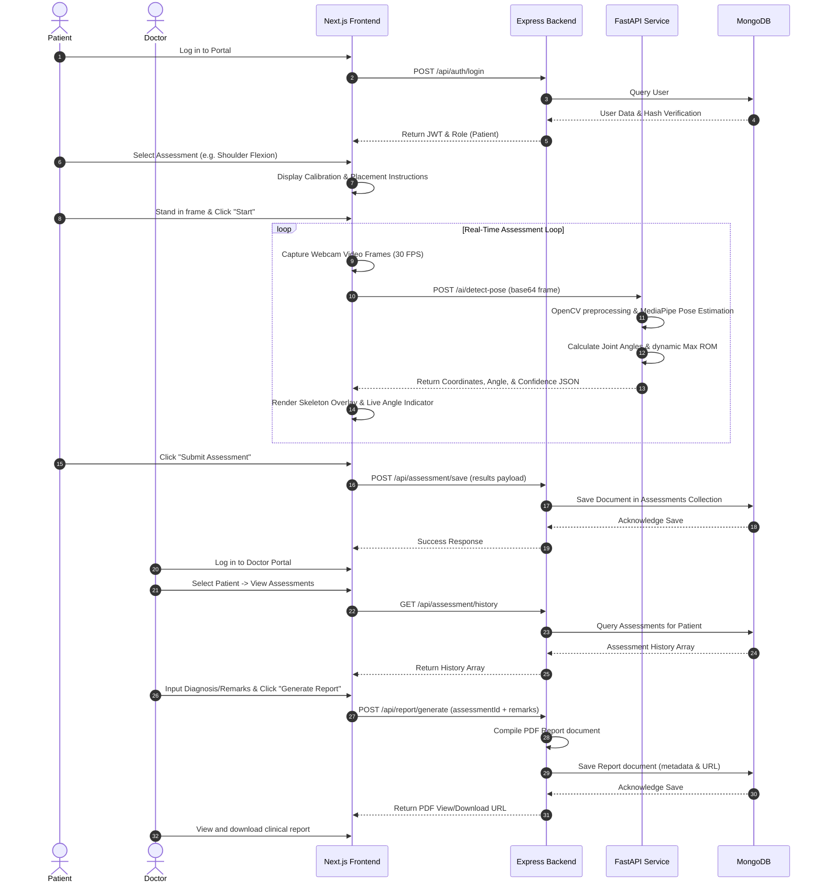
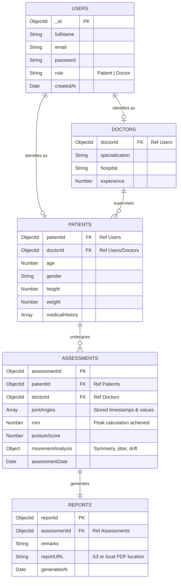

# Flexion AI – Project Understanding Report
**Author:** Lead Full Stack & AI Engineer  
**Date:** August 6, 2026  
**Target:** Remote Musculoskeletal Screening and Real-Time Pose Estimation for Telehealth  

---

## 1. Executive Summary

**Flexion AI** is a state-of-the-art, service-oriented healthcare platform designed to facilitate remote musculoskeletal (MSK) screenings. By leveraging standard webcams and markerless pose estimation, it bridges the gap between clinicians and patients who cannot attend in-person physical therapy sessions. 

The core system uses a tripartite service architecture:
1. A interactive **Next.js** frontend for patient workflows and clinician dashboards.
2. A robust **Node.js/Express.js** backend managing user management, data storage, and reporting.
3. A high-performance **Python/FastAPI** AI microservice running computer vision pipelines.

Development is scheduled in two distinct phases: **Semester 7 (MVP - 70%)** focuses on core kinematic assessment pipelines, database persistence, and user dashboards; **Semester 8 (Advanced Features - 30%)** introduces WebRTC video consults, Docker containerization, cloud deployment, and advanced repetition/movement quality modeling.

---

## 2. Overall Workflow

The lifecycle of an assessment session spans across all services, ensuring patient engagement, real-time feedback, and secure persistence of medical metrics:



---

## 3. System Architecture

Flexion AI utilizes a modular, decoupled architecture where each boundary is strictly delineated via RESTful endpoints.

```
       +---------------------------------------------+
       |             Next.js Frontend                |
       |  (UI, Dashboards, Webcams, GSAP, overlays)  |
       +-------+-----------------------------+-------+
               |                             |
               | (Auth, Data, Reports)       | (Video Frames, real-time JSON)
               |                             |
               v                             v
  +------------+------------+      +---------+------------+
  |     Express Backend      |      |   FastAPI AI Service |
  | (JWT, Controllers, PDFs) |      | (MediaPipe, OpenCV)  |
  +------------+------------+      +---------+------------+
               |                             |
               | (Mongoose ODM)              | (Direct save API, optional)
               v                             |
       +-------+--------+                    |
       |    MongoDB     |<-------------------+
       +----------------+
```

### Communication Protocols & Interfaces
*   **Frontend ↔ Express Backend**: Standard HTTP REST client exchanging JSON. Handled using Axios or Fetch with Bearer token authentication headers.
*   **Frontend ↔ FastAPI Service**: High-speed REST calls for pose detection. (See *Risks* regarding HTTP overhead vs. WebSockets).
*   **FastAPI Service ↔ Express Backend**: Secure server-to-server HTTP API calls used to persist calculated kinematics direct to backend.
*   **Express Backend ↔ MongoDB**: Persistent socket connections maintained by Mongoose ODM.

---

## 4. Folder Structure Recommendation

To support multi-developer setup and future Docker integration (Semester 8), we propose a **monorepo layout** separating the three services while retaining a single codebase root:

```
flexion-ai/
├── docs/                               # Project documentation (Existing)
├── frontend/                           # Next.js Frontend App
│   ├── public/                         # Static assets (icons, medical diagrams)
│   ├── src/
│   │   ├── app/                        # Next.js App Router (Layouts, Portals)
│   │   │   ├── auth/                   # Registration, Login pages
│   │   │   ├── patient/                # Patient Dashboard, Profile, Session
│   │   │   ├── doctor/                 # Doctor Dashboard, Reports, Remarks
│   │   │   └── layout.tsx              # Root HTML layout (Inter font, global styles)
│   │   ├── components/                 # React UI elements
│   │   │   ├── ui/                     # Atoms (Buttons, Inputs, Modals)
│   │   │   ├── assessment/             # WebcamStream, PoseCanvas overlays
│   │   │   └── dashboard/              # AssessmentCards, ProgressCharts
│   │   ├── hooks/                      # Custom hooks (useWebcam, useAuth)
│   │   ├── services/                   # Client-side API wrappers (Express, AI)
│   │   ├── lib/                        # Core utilities (GSAP configurations)
│   │   └── types/                      # TypeScript schemas (interfaces)
│   ├── package.json
│   ├── tsconfig.json
│   └── tailwind.config.js
├── backend/                            # Express Backend
│   ├── src/
│   │   ├── config/                     # Environment variables, MongoDB connect
│   │   ├── models/                     # Mongoose Schemas
│   │   │   ├── User.ts
│   │   │   ├── Patient.ts
│   │   │   ├── Doctor.ts
│   │   │   ├── Assessment.ts
│   │   │   └── Report.ts
│   │   ├── controllers/                # Request validation & orchestration
│   │   ├── services/                   # Business logic (Auth, Report Generator)
│   │   ├── middleware/                 # AuthMiddleware, RoleCheck, ErrorHandler
│   │   ├── routes/                     # Router configurations
│   │   ├── utils/                      # Helper libraries (PDF generation)
│   │   └── server.ts                   # Express Entry point
│   ├── package.json
│   └── tsconfig.json
└── ai-service/                         # Python FastAPI Service
    ├── pose/                           # MediaPipe landmarks logic
    │   ├── detector.py
    │   └── visualizer.py
    ├── rom/                            # Biomechanical vector calculations
    │   └── kinematics.py
    ├── posture/                        # Symmetry and stability algorithms
    ├── report/                         # Natural language generator for summaries
    ├── utils/                          # Geometry math & confidence filter helpers
    ├── main.py                         # FastAPI webserver configuration
    ├── requirements.txt
    └── Dockerfile
```

---

## 5. Technology Stack Review

| Technology | Selection Rationale | Healthcare Context Relevance |
| :--- | :--- | :--- |
| **Next.js & React** | Component modularity, route-level code splitting, state hooks. | Enables immediate render-swaps between patient webcam views and data dashboards. |
| **TypeScript** | Strict compile-time type boundaries. | Eliminates field-mapping errors when parsing sensitive patient profiles and ROM ranges. |
| **Tailwind CSS** | Atomic styling engine. | Accelerates the creation of a responsive, clean, and clinical UI layout. |
| **GSAP** | Hardware-accelerated, high-performance web animations. | Creates smooth micro-animations for posture guidelines to guide patients gently through assessments. |
| **Node.js & Express** | Lightweight, event-driven, non-blocking input/output runtime. | Ideal for high-concurrency requests transferring raw metadata and JSON assessment logs. |
| **FastAPI (Python)** | Asynchronous execution loops, automatic Swagger page generation. | Extremely fast response latency, matches native C++ libraries binding Python wrappers. |
| **Google MediaPipe Pose** | Markerless 33 coordinate pose tracking. Runs locally without expensive server GPUs. | Ideal for home environments where patients are using standard webcams and laptops. |
| **OpenCV & NumPy** | Fast image processing and optimized multidimensional matrix operations. | Essential for frame adjustments, pixel transformations, and Euclidean spatial math. |
| **MongoDB & Mongoose** | Flexible BSON schemas that permit varied nested structures. | Fits heterogeneous clinical records where each joint assessment has varying coordinates and ROM metadata. |

---

## 6. Database Review

Mongoose schemas represent standard clinical models linked via structured object references (`mongoose.Schema.Types.ObjectId`).



*   **Database Constraints**: Strict indexes should be created on `email` inside the `Users` collection to ensure uniqueness.
*   **Relationship Referential Integrity**: Standard MongoDB is non-relational; cascade deletes on `Users` must be handled manually via middleware hooks in the Express backend models to clean up child `Patients` or `Doctors` profiles.

---

## 7. API Review

The defined REST API endpoints provide a complete footprint for a classic CRUD application. However, a Senior Architect must highlight several **critical gaps** before code generation begins:

### Critical Architectural Gaps:
1.  **AI Service Security**: No authentication or validation is declared for the `/ai/detect-pose` endpoint. Anyone can flood the server with arbitrary files, causing high CPU/RAM overhead. A JWT validation middleware or API gateway authentication is required.
2.  **State Management for ROM session**: The endpoint `POST /ai/calculate-rom` implies that FastAPI tracks historical frames. However, the rules specify that **FastAPI must be stateless**. If FastAPI is stateless, the frontend must accumulate historical frames, or send a full array of coordinate arrays for computing the final ROM.
3.  **Real-Time Data Streaming**: Exchanging video frames via HTTP POST (base64) at 30 FPS introduces massive HTTP header overhead, parsing lag, and potential server bottlenecks. A **WebSocket endpoint** (`ws://ai/pose-stream`) is the industry standard for real-time video overlays.
4.  **Security & HIPAA Compliance of PDF Reports**: The reports collection contains `reportURL`. Standard public static folders in Express backends run the risk of exposing protected health information (PHI) via URL enumeration. PDF files should be generated inside a restricted storage folder with signed URLs or token-gated streaming endpoints.

---

## 8. AI Module Review

The computer vision engine coordinates five components: OpenCV, MediaPipe, Landmark confidence verification, Angle Calculations, and Motion Analysis.

```
       +------------------+
       |   Webcam Frame   |
       +--------+---------+
                |
                v
       +------------------+
       | OpenCV Pipeline  | <-- Image resizing, BGR-to-RGB conversion, normalization.
       +--------+---------+
                |
                v
       +------------------+
       |  MediaPipe Pose  | <-- Generates 33 landmarks containing (x,y,z) and visibility.
       +--------+---------+
                |
                v
       +------------------+
       | Confidence Check | <-- Discards frame if visibility threshold < 0.65.
       +--------+---------+
                |
                v
       +------------------+
       |   Vector Math    | <-- Calculates 2D vectors and applies Cosine Rule.
       +--------+---------+
                |
                v
       +------------------+
       |   ROM & Motion   | <-- Dynamic peak angle tracking, jitter and asymmetry review.
       +------------------+
```

### 1. Vector Math Formulation
Let three joint landmarks be:
*   $\mathbf{A} = (x_a, y_a)$ (Joint origin anchor, e.g. Shoulder)
*   $\mathbf{B} = (x_b, y_b)$ (Vertex center, e.g. Elbow)
*   $\mathbf{C} = (x_c, y_c)$ (End terminal, e.g. Wrist)

We construct two vectors originating from the joint center $\mathbf{B}$:
$$\mathbf{u} = \mathbf{A} - \mathbf{B} = (x_a - x_b, y_a - y_b)$$
$$\mathbf{v} = \mathbf{C} - \mathbf{B} = (x_c - x_b, y_c - y_b)$$

The angle $\theta$ (in radians) is calculated using the dot product formula:
$$\cos(\theta) = \frac{\mathbf{u} \cdot \mathbf{v}}{\|\mathbf{u}\| \|\mathbf{v}\|} = \frac{u_x v_x + u_y v_y}{\sqrt{u_x^2 + u_y^2} \sqrt{v_x^2 + v_y^2}}$$

Applying inverse cosine and converting to degrees:
$$\theta = \arccos\left(\frac{\mathbf{u} \cdot \mathbf{v}}{\|\mathbf{u}\| \|\mathbf{v}\|}\right) \times \left(\frac{180}{\pi}\right)$$

### 2. Range of Motion (ROM) & Movement Quality
*   **ROM Peak Selection**: Calculated as:
    $$\text{ROM} = \max(\theta_1, \theta_2, \dots, \theta_n)$$
    over a sequence of valid assessment frames.
*   **Stability / Jitter Analysis**: Computes the rate of change of the angle:
    $$\omega_t = \frac{\theta_t - \theta_{t-1}}{\Delta t}$$
    Spikes in $\omega_t$ represent tremor or jerky movements, indicating potential structural weakness or coordination issues.
*   **Symmetry Comparison**: Left vs Right asymmetry is defined by:
    $$\text{Asymmetry \%} = \frac{|\text{ROM}_{\text{Left}} - \text{ROM}_{\text{Right}}|}{\max(\text{ROM}_{\text{Left}}, \text{ROM}_{\text{Right}})} \times 100$$

---

## 9. Clinical Protocol Review

The assessment library currently includes **Shoulder Flexion**, **Shoulder Abduction**, **Elbow Flexion**, **Knee Flexion**, **Hip Flexion**, and **Neck Rotation**.

### Critical Evaluation of Protocol Feasibility:
*   **Reference Ranges**: The ranges (e.g., Elbow Flexion: $145^\circ - 150^\circ$, Knee Flexion: $130^\circ - 135^\circ$) are clinically accurate based on AAOS criteria.
*   **Sagittal vs. Frontal Plane Issues (Crucial Software Risk)**: 
    *   *Shoulder Flexion (SF001)* and *Hip Flexion (HF001)* require raising limbs **forward**. If the patient is facing the camera, 2D coordinates cannot calculate these angles accurately due to foreshortening (z-axis compression). These movements **must be recorded in profile view (sagittal plane)**.
    *   *Shoulder Abduction (SA001)* must be recorded **facing the camera (frontal plane)**.
    *   The protocol specifies: "Body facing camera" for Shoulder Flexion (SF001). This is a **clinical engineering error**. Facing the camera will result in static angles around $180^\circ$ even with maximum arm elevation, as the camera cannot gauge depth.

> [!WARNING]
> Standing angle instruction mismatch will lead to clinical assessment failure. The software setup UI must dynamically guide patients to stand either sideways (profile) or front-facing based on the selected assessment ID.

---

## 10. Feature Roadmap Review

The project roadmap is cleanly structured, but we suggest shifting tasks to avoid integration problems later:

### Chronological Review of Semester 7 Milestones:
*   **Milestones 1-4 (Foundations, Auth, Portals)**: Realistic. 
*   **Milestones 5-7 (AI, Angle, ROM)**: Creating these standalone before backend integration is a good practice.
*   **Milestones 8-9 (Backend Integration & Reports)**: Standard implementation.

### Suggested Improvements:
1.  **Introduce Containerization early**: Move the Docker structure from Milestone 12 (Semester 8) to Milestone 1 (Semester 7) exclusively for the FastAPI service. Python environments, MediaPipe, and OpenCV are notorious for platform dependency issues (e.g. dynamic link library errors on Windows vs Linux). Containerizing early saves debugging time.
2.  **Add Calibration Steps in Milestone 5**: Do not wait for late iterations to validate if the patient is fully in frame. Add basic bounding-box checks in Milestone 5 to verify the distance (2-3 meters) using known reference markers (e.g. distance between shoulders in pixels).

---

## 11. Technical Risks

*   **Risk 1: Network Overhead (Frame streaming)**  
    Sending raw image frames continuously over HTTP POST is highly inefficient. It can freeze the frontend UI thread and overwhelm the FastAPI single-worker threads.
*   **Risk 2: Depth Distortion (2D Webcam constraints)**  
    MediaPipe Pose estimates 3D coordinates ($z$), but depth values are calculated relative to the hip. They are prone to significant noise compared to clinical goniometers, especially under variable lighting or off-angle camera setups.
*   **Risk 3: HIPAA/GDPR Compliance**  
    Storing raw clinical PDF reports containing medical history and patient ROMs without strict access control violates healthcare regulations.
*   **Risk 4: Jitter and Occlusion**  
    Loose clothing or hands overlapping the body will block landmarks. Discarding frames with low confidence levels is necessary, but this might result in empty data gaps.

---

## 12. Engineering Suggestions

1.  **Dual-Engine Hybrid Processing (Recommended)**  
    Run standard MediaPipe JS SDK in the user's browser to draw the skeleton in real-time at 30 FPS. Send the clean JSON array of coordinate points to the FastAPI Python service at the end of the session to compute advanced clinical metrics. This reduces network data transfer and server processing costs.
2.  **Implement Websockets if Server Processing is required**  
    If real-time server-side feedback is required, swap the HTTP frame posting with a standard WebSocket loop (`ws://.../ai/pose-stream`) to avoid HTTP header bloat.
3.  **PDF Access Control**  
    Do not expose the PDF files via a static public folder path. Secure the files by streaming them through a backend Express router route protected by a JWT auth middleware (e.g., `GET /api/report/:id/download`).
4.  **Standardize Calibration Steps**  
    Implement a simple screen alignment layout (such as an overlay outline) on the frontend canvas. This ensures the user is standing at the correct angle (sideways vs front) and distance before calculations begin.

---

## 13. Clarifying Questions

1.  **AI Video Stream Location**: Should the AI pose estimation run entirely server-side (webcam frames posted to FastAPI), or should we use browser-based pose estimation for live feedback and send coordinates to the backend?
2.  **Correction of Camera Angles**: Can we update the clinical protocol document to require a sagittal/side-profile camera orientation for Shoulder Flexion (SF001), Hip Flexion (HF001), and Knee Flexion (KF001)?
3.  **PDF Report Storage Plan**: Where will the PDF reports be stored (local server files, MongoDB GridFS, or cloud storage like AWS S3)?
4.  **Intra-Service Security**: Is there an internal security token or JWT verification intended between the FastAPI server and the Express backend for `POST /api/assessment/save`?
